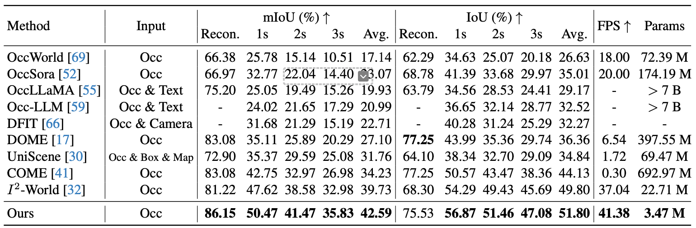
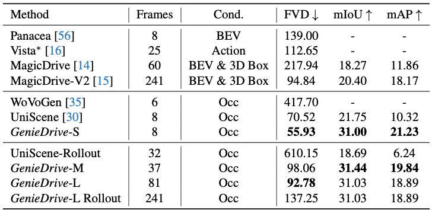

<div align="center">

### **GenieDrive: Towards Physics-Aware Driving World Model with 4D Occupancy Guided Video Generation**

[Zhenya Yang](https://scholar.google.com/citations?user=4nk3hAgAAAAJ&hl=zh-CN)<sup>1</sup>, 
[Zhe Liu](https://happinesslz.github.io)<sup>1,†</sup>, 
[Yuxiang Lu](https://innovator-zero.github.io)<sup>1</sup>, 
[Liping Hou](#)<sup>2</sup>, 
[Chenxuan Miao](https://scholar.google.com/citations?user=184t8cAAAAAJ&hl=en)<sup>1</sup>, 
[Siyi Peng](#)<sup>2</sup>, 
[Bailan Feng](#)<sup>2</sup>, 
[Xiang Bai](https://xbai.vlrlab.net)<sup>3</sup>, 
[Hengshuang Zhao](https://i.cs.hku.hk/~hszhao/)<sup>1,✉</sup>

<br>
<sup>1</sup> The University of Hong Kong,
<sup>2</sup> Huawei Noah's Ark Lab,
<sup>3</sup> Huazhong University of Science and Technology
<br>
† Project leader, ✉ Corresponding author.
<br>

> 📑 [[arXiv](https://arxiv.org/abs/2512.12751)], ⚙️ [[web page](https://huster-yzy.github.io/geniedrive_project_page/)], 🤗 [[model weights](#)]


<div align="center">

<p><em>Overview of our GenieDrive</em></p>
</div>

</div>

## 📢 News

- **[2025/12/15]** We release GenieDrive paper on arXiv. 🔥
* **2025.12.15**: [DrivePI](https://github.com/happinesslz/DrivePI) paper released! A novel spatial-aware 4D MLLM that serves as a unified Vision-Language-Action (VLA) framework that is also compatible with vision-action (VA) models. 🔥
* **2025.11.04**: Our previous work [UniLION](https://github.com/happinesslz/UniLION) has been released. Check out the [codebase](https://github.com/happinesslz/UniLION) for unified autonomous driving model with Linear Group RNNs. 🚀
* **2024.09.26**: Our work [LION](https://github.com/happinesslz/LION) has been accepted by NeurIPS 2024. Visit the [codebase](https://github.com/happinesslz/LION) for Linear Group RNN for 3D Object Detection. 🚀

## 📋 TODO List

- [ ] Release 4D occupancy forecasting code and model weights.
- [ ] Release multi-view video generator code and weights.

## 📈 Results

Our method achieves a remarkable increase in 4D Occupancy forecasting performance, with a 7.2\% increase in mIoU and a 4\% increase in IoU.
Moreover, our tri-plane VAE compresses occupancy into a latent tri-plane that is only 58\% the size used in previous methods, while still maintaining superior reconstruction performance. 
This compact latent representation also contributes to fast inference (41 FPS) and a minimal parameter count of only 3.47M (including the VAE and prediction module).

<div align="center">

<p><em>Performance of 4D Occupancy Forecasting</em></p>
</div>

We train three driving video generation models that differ only in video length: S (8 frames, ~0.7 s), M (37 frames, ~3 s), and L (81 frames, ~7 s). Through rollout, the L model can further generate long multi-view driving videos of up to 241 frames (~20 s).
GenieDrive consistently outperforms previous occupancy-based methods across all metrics, while also enabling much longer video generation.

<div align="center">

<p><em>Performance of Multi-View Video Generation</em></p>
</div>

<!-- ## 🎮 Video Demos
Our GenieDrive supports physics-aware driving video generation, long video generation, video editing, and sim-to-real capabilities. Below are some examples. All videos are compressed for smaller file size.

### Physics-Aware Video Generation

<div style="display: flex; justify-content: space-between; gap: 8px; text-align: center;">

  <div style="width: 32%;">
    <video src="videos/turn_left.mp4" controls width="100%"></video>
    <p style="font-size: 15px">
      (a) Turn left
    </p>
  </div>

  <div style="width: 32%;">
    <video src="videos/go_straight.mp4" controls width="100%"></video>
    <p style="font-size: 15px">
      (b) Go straight
    </p>
  </div>

  <div style="width: 32%;">
    <video src="videos/turn_right.mp4" controls width="100%"></video>
    <p style="font-size: 15px">
      (c) Turn right
    </p>
  </div>

</div>

### Long Video Generation

<div style="display: flex; justify-content: space-between; gap: 8px; text-align: center;">

  <div style="width: 80%;">
    <video src="videos/long_video.mp4" controls width="100%"></video>
  </div>

</div>

### Driving Scene Editing

<div style="display: flex; justify-content: space-between; gap: 8px; text-align: center;">

  <div style="width: 50%;">
    <video src="videos/before_edit_0.mp4" controls width="100%"></video>
     <p style="font-size: 15px">
      Prior to Removal
    </p>
  </div>

  <div style="width: 50%;">
    <video src="videos/edit_0.mp4" controls width="100%"></video>
    <p style="font-size: 15px">
      Post Removal
    </p>
  </div>
</div>

<div style="display: flex; justify-content: space-between; gap: 8px; text-align: center;">

  <div style="width: 50%;">
    <video src="videos/before_edit_1.mp4" controls width="100%"></video>
     <p style="font-size: 15px">
      Prior to Insertion
    </p>
  </div>

  <div style="width: 50%;">
    <video src="videos/edit_1.mp4" controls width="100%"></video>
    <p style="font-size: 15px">
      Post Insertion
    </p>
  </div>
</div>

### Sim-to-Real

<div style="display: flex; justify-content: space-between; gap: 8px; text-align: center;">

  <div style="width: 45%;">
    <video src="videos/sim_1.mp4" controls width="100%"></video>
     <p style="font-size: 15px">
      Synthetic Scene
    </p>
  </div>

  <div style="width: 70%;">
    <video src="videos/real_1.mp4" controls width="100%"></video>
    <p style="font-size: 15px">
      Sim-to-Real Generation
    </p>
  </div>
</div> -->

## 📝 Citation

```bibtex
@article{yang2025geniedrive,
  author    = {Yang, Zhenya and Liu, Zhe and Lu, Yuxiang and Hou, Liping and Miao, Chenxuan and Peng, Siyi and Feng, Bailan and Bai, Xiang and Zhao, Hengshuang},
  title     = {GenieDrive: Towards Physics-Aware Driving World Model with 4D Occupancy Guided Video Generation},
  journal   = {arXiv:2512.12751},
  year      = {2025},
}
```

## Acknowledgements
We thank these great works and open-source repositories: [I2-World](https://github.com/lzzzzzm/II-World), [UniScene](https://github.com/Arlo0o/UniScene-Unified-Occupancy-centric-Driving-Scene-Generation), [DynamicCity](https://github.com/3DTopia/DynamicCity),  and [VideoX-Fun](https://github.com/aigc-apps/VideoX-Fun).