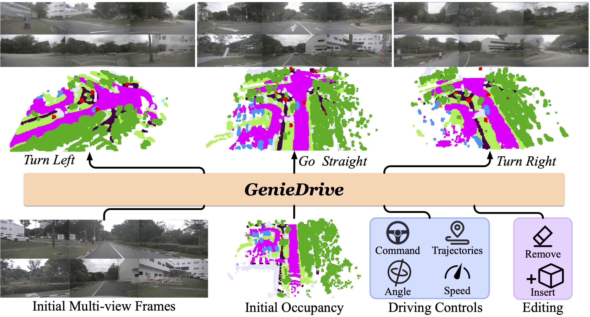
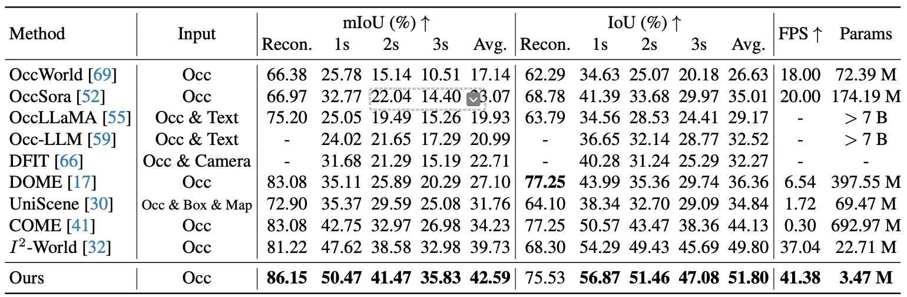
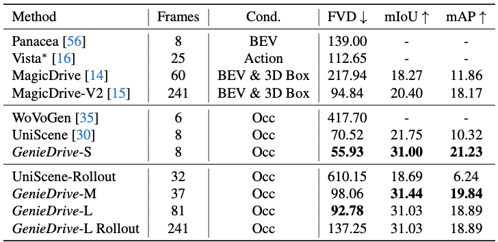

<div align="center">

### **GenieDrive: Towards Physics-Aware Driving World Model with 4D Occupancy Guided Video Generation**

[Zhenya Yang](https://huster-yzy.github.io/)<sup>1</sup>, 
[Zhe Liu](https://happinesslz.github.io)<sup>1,†</sup>, 
[Yuxiang Lu](https://innovator-zero.github.io)<sup>1</sup>, 
[Liping Hou](#)<sup>2</sup>, 
[Chenxuan Miao](https://scholar.google.com/citations?user=184t8cAAAAAJ&hl=en)<sup>1</sup>, 
[Siyi Peng](#)<sup>2</sup>, 
[Bailan Feng](#)<sup>2</sup>, 
[Xiang Bai](https://xbai.vlrlab.net)<sup>3</sup>, 
[Hengshuang Zhao](https://i.cs.hku.hk/~hszhao/)<sup>1,✉</sup>

<br>
<sup>1</sup> The University of Hong Kong,
<sup>2</sup> Huawei Noah's Ark Lab,
<sup>3</sup> Huazhong University of Science and Technology
<br>
† Project leader, ✉ Corresponding author.
<br>

> 📑 [[arXiv](https://arxiv.org/abs/2512.12751)], ⚙️ [[project page](https://huster-yzy.github.io/geniedrive_project_page/)], 🤗 [[model weights](https://huggingface.co/ANIYA673/GenieDrive)]


<div align="center">

<p><em>Overview of our GenieDrive</em></p>
</div>

</div>

## 📢 News
- **[2026/4/29]** We have released the code for GenieDrive.
- **2026/2/21**: [DrivePI](https://github.com/happinesslz/DrivePI) and GenieDrive have been accepted by CVPR 2026!
- **2025/12/15**: We release GenieDrive paper on arXiv. 🔥
* **2025.12.15**: [DrivePI](https://github.com/happinesslz/DrivePI) paper released! A novel spatial-aware 4D MLLM that serves as a unified Vision-Language-Action (VLA) framework that is also compatible with vision-action (VA) models. 🔥
* **2025.11.04**: Our previous work [UniLION](https://github.com/happinesslz/UniLION) has been released. Check out the [codebase](https://github.com/happinesslz/UniLION) for unified autonomous driving model with Linear Group RNNs. 🚀
* **2024.09.26**: Our work [LION](https://github.com/happinesslz/LION) has been accepted by NeurIPS 2024. Visit the [codebase](https://github.com/happinesslz/LION) for Linear Group RNN for 3D Object Detection. 🚀

## 📋 TODO List

- ✅ Release 4D occupancy forecasting code and model weights.
- ✅ Release multi-view video generator code and weights.

## Getting Started

This repository contains a three-stage pipeline for driving scene generation:

1. **`occ_gen`**: generate occupancy (`occ`)
2. **`occ_rasterizer`**: rasterize the occupancy into semantic maps
3. **`occ_render`**: generate the final videos based on the rendered semantic maps

### Environment Setup

Please refer to [`occ_gen/README.md`](occ_gen/README.md) for occ generation/forecasting. (geniedrive-occ)

Please refer to [`occ_render/README.md`](occ_render/README.md) and [`occ_rasterizer/README.md`](occ_rasterizer/README.md) for occupancy conditioned video generation. (geniedrive-video)

### Data Preparation

**We have provided preprocessed items that can be used directly for video generation, without the need to run `occ_gen` or download the full NuScenes dataset. For more details, please refer to [`occ_render/README.md`](occ_render/README.md).**

Before running the following steps, please make sure that you have downloaded [NuScenes](https://www.nuscenes.org/nuscenes#download) and [Occ3D-NuScenes](https://tsinghua-mars-lab.github.io/Occ3D/).

To simplify data loading and processing, we recommend creating symbolic links from your NuScenes dataset to the `data/` directories under `occ_gen`, `occ_rasterizer`, and `occ_render`.
```
cd occ_gen
ln -s [Your Nuscenes Path] data
cd occ_rasterizer
ln -s [Your Nuscenes Path] data
cd occ_render
ln -s [Your Nuscenes Path] data
```

Download pickle files from huggingface:
```
cd occ_gen
huggingface-cli download --resume-download ANIYA673/GenieDrive --include="*.pkl" --local-dir data
```


Then your dictory should look like:

```
.
├── occ_gen/
│   └── data/
├── occ_rasterizer/
│   └── data/
└── occ_render/
    └── data/
          ├── v1.0-trainval/
          ├── gts/                         # Occ3D-nus occupancy labels
          ├── samples/                     # nuScenes keyframes
          ├── sweeps/                      # nuScenes non-keyframes / intermediate frames
          ├── world-nuscenes_infos_train.pkl
          ├── world-nuscenes_infos_val.pkl
          ├── nuscenes_interp_12Hz_infos_train.pkl
          ├── nuscenes_interp_12Hz_infos_val.pkl
          ├── nuscenes_infos_temporal_train_3keyframes.pkl
          └── nuscenes_infos_temporal_val_3keyframes.pkl
```

### Workflow Overview

We provide 2 workflows to generate multi-view driving videos. The only difference is the source of the occupancy. For workflow 1, we generate video based on our model predicted occupancy:

`occ_gen -> occ_rasterizer -> occ_render`

While workflow 2 utilize the existing occ from Nuscenes occupancy/ Edited occupancy/ Carla occupancy to generate videos:

`gt_occ -> occ_rasterizer -> occ_render`


### Model Inference & Training
For occupancy generation, please refer to [`occ_gen/README.md`](occ_gen/README.md).

For occupancy-conditioned video generation, please refer to [`occ_render/README.md`](occ_render/README.md).

## 📈 Results

Our method achieves a remarkable increase in 4D Occupancy forecasting performance, with a 7.2\% increase in mIoU and a 4\% increase in IoU.
Moreover, our tri-plane VAE compresses occupancy into a latent tri-plane that is only 58\% the size used in previous methods, while still maintaining superior reconstruction performance. 
This compact latent representation also contributes to fast inference (41 FPS) and a minimal parameter count of only 3.47M (including the VAE and prediction module).

<div align="center">

<p><em>Performance of 4D Occupancy Forecasting</em></p>
</div>

We train three driving video generation models that differ only in video length: S (8 frames, ~0.7 s), M (37 frames, ~3 s), and L (81 frames, ~7 s). Through rollout, the L model can further generate long multi-view driving videos of up to 241 frames (~20 s).
GenieDrive consistently outperforms previous occupancy-based methods across all metrics, while also enabling much longer video generation.

<div align="center">

<p><em>Performance of Multi-View Video Generation</em></p>
</div>


## 📝 Citation

```bibtex
@article{yang2025geniedrive,
  author    = {Yang, Zhenya and Liu, Zhe and Lu, Yuxiang and Hou, Liping and Miao, Chenxuan and Peng, Siyi and Feng, Bailan and Bai, Xiang and Zhao, Hengshuang},
  title     = {GenieDrive: Towards Physics-Aware Driving World Model with 4D Occupancy Guided Video Generation},
  journal   = {arXiv:2512.12751},
  year      = {2025},
}
```

## Acknowledgements
We thank these great works and open-source repositories: [I2-World](https://github.com/lzzzzzm/II-World), [UniScene](https://github.com/Arlo0o/UniScene-Unified-Occupancy-centric-Driving-Scene-Generation), [DynamicCity](https://github.com/3DTopia/DynamicCity), [MMDectection3D](https://github.com/open-mmlab/mmdetection3d) and [VideoX-Fun](https://github.com/aigc-apps/VideoX-Fun).